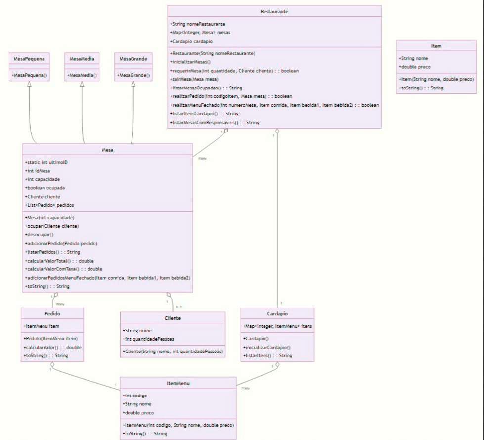

# Documentação do Projeto

A documentação do projeto é composta pelos seguintes itens: 

 - [Diagramas de classe do projeto]() 
 - [Instruções para uso](/docs/instrucoes.md)
 - [Quadro de tarefas do projeto](https://github.com/DisciplinasProgramacao/pm-projeto2024-1-modular_grupo_pampulha) 

